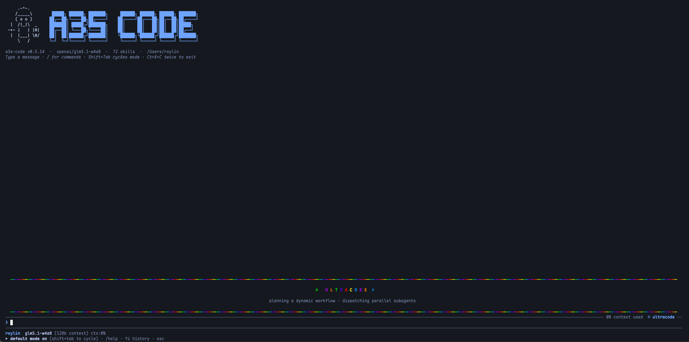

# A3S Code

**A Rust agent runtime and the execution core behind the `a3s code` terminal
coding workspace.**

A3S Code gives a coding agent the parts it should not improvise: context
assembly, tool visibility, permission checks, human approval, memory,
delegation, dynamic workflow execution, persistence, verification evidence, and
event replay. The interactive product surface is the `a3s code` TUI, shipped by
the `a3s` CLI and rendered with the `a3s-tui` terminal framework.

[](https://crates.io/crates/a3s-code-core)
[](LICENSE)

## What It Is

A3S Code is a local runtime, not a hosted agent service. It owns the agent loop
and exposes it through a Rust crate. The TUI is one application built on that
runtime.

```text
prompt
  -> context assembly
  -> optional planning and goal tracking
  -> tool selection / delegated child tasks / dynamic workflow steps
  -> permission and confirmation checks
  -> execution
  -> events, artifacts, memory, and verification evidence
  -> compaction and persistence
```

Repository boundaries:

| Name | What it is | Primary repo |
| --- | --- | --- |
| **A3S Code / `a3s-code-core`** | Rust runtime crate for embedding coding-agent sessions and implementing the TUI execution path. | <https://github.com/A3S-Lab/Code> |
| **`a3s code` TUI** | Interactive terminal coding workspace shipped by the `a3s` CLI. It drives `a3s-code-core` and renders streamed events. | <https://github.com/A3S-Lab/Cli> |
| **`a3s-tui`** | Shared terminal UI framework used by the CLI. It is a UI toolkit, not the agent runtime. | <https://github.com/A3S-Lab/TUI> |
| **A3S Flow** | Workflow engine used by `DynamicWorkflowRuntime` for replayable per-turn dynamic workflows. | <https://github.com/A3S-Lab/Flow> |
| **A3S monorepo** | Docs, submodule pins, release orchestration, and related crates. | <https://github.com/A3S-Lab/a3s> |

Use `a3s code` when you want the full terminal product. Use
`a3s-code-core` when you are building another Rust host, runner, IDE bridge, or
controlled agent service around the same runtime.



## Install And Run

Install the `a3s` CLI to use the TUI:

```bash
brew install A3S-Lab/tap/a3s

# or from crates.io
cargo install a3s

# or from source
cargo install --git https://github.com/A3S-Lab/Cli
```

Run it from the workspace the agent should inspect:

```bash
a3s code
a3s code resume <session-id>
a3s code resume
a3s code update
```

Common first-run flow:

```text
/init          # inspect the repository and create or update AGENTS.md
/model         # pick a configured provider or account-backed model
/effort        # choose low, medium, high, xhigh, max, or ultracode
/ide           # open the workspace tree and terminal editor
/help          # open the full command and shortcut guide
```

Install the Rust runtime crate when embedding A3S Code:

```bash
cargo add a3s-code-core
```

## TUI Capability Overview

`a3s code` is a complete agentic workspace in the terminal. It combines the
coding chat loop, file and config editing, durable context, local asset
development, optional host integrations, runtime fan-out, trusted runtime
views, and engineered automation loops.

| Area | What the TUI provides |
| --- | --- |
| Coding loop | Chat with the coding agent, stream reasoning/text/tool events, approve or deny gated tools, switch `/auto`, run direct shell turns with `!`, set a persistent `/goal`, ask background side questions with `/btw`, clear context, and fork sessions. |
| Workspace UI | `/ide` opens a file tree and editor, `/config` edits the active config, `/output` shows tool calls with arguments/results, and file edits render bounded diffs through shared TUI components. |
| Models | `/model` switches configured ACL providers and signed-in account-backed model tabs when available. |
| Effort | `/effort` changes reasoning budget, tool-round budget, continuation count, and rigor guidance from `low` through `max` and `ultracode`. |
| Tools and safety | File, search, shell, git, web, structured-output, MCP, PTC `program`, `task`, and `parallel_task` tools all pass through workspace boundaries, permission policy, HITL approval, timeouts, hooks, and traces. |
| Context and memory | The footer tracks context fill and auto-compaction. `/ctx` searches past sessions, `/ctx <n>` attaches a transcript window, `/ctx save <n>` promotes it to memory, `/sleep` consolidates the day, and `/memory` browses durable memories as an event/entity graph. |
| Dynamic workflows | `ultracode` and `?` DeepResearch can use `DynamicWorkflowRuntime`, a local A3S Flow-backed runtime that records workflow and step history while sandboxed PTC scripts perform tool work. |
| Parallel work | Local fan-out uses the native host-side `parallel_task` tool. Dynamic workflows schedule a Flow step named `parallel_task` when they need local parallel subagents; QuickJS/PTC scripts do not call `parallel_task` directly. |
| Optional runtime tools | A configured host can register additional runtime tools after `/login`; local tools and `parallel_task` remain available without an account. |
| Deep research | Prefix a prompt with `?` to start DeepResearch. The TUI gathers evidence through `DynamicWorkflowRuntime`, uses registered runtime tools when available, falls back to local `parallel_task` when needed, then asks the model to synthesize a cited report and artifacts. |
| Asset development | `/agent`, `/mcp`, `/skill`, and `/okf` enter local development modes with an active asset, review commands, clone/draft flows, and publish/deploy/status surfaces. |
| Workflow assets | `/flow` selects or drafts workflow DAG files for local review and optional host publication. |
| Knowledge | `/kb` manages a local personal knowledge vault. `/okf` manages shareable OKF knowledge-package assets. |
| Engineered loops | `/loop init`, `/loop run`, `/loop audit`, and `/loop logs` manage durable maker/checker loops under `.a3s/loops` with reports, budgets, state files, and optional runtime/view evidence. |
| Operations | `/help` opens the command guide, `/theme` changes syntax themes, `/plugin` and `/reload` refresh skills/plugins, `/top` observes local agent process activity, `/view` reopens the latest trusted runtime view, and `/update` upgrades and restarts the CLI. |

## TUI Command Catalog

The TUI command palette is intentionally small at the top level. Parameterized
forms live under the asset or context family that owns them.

| Surface | Commands | Capability |
| --- | --- | --- |
| Conversation | `/clear`, `/compact`, `/fork`, `/goal`, `/btw`, `/auto`, `/exit` | Reset or branch the conversation, compact older context, pin a persistent goal, run a background side question, switch approval mode, or leave the TUI. |
| Models and depth | `/model`, `/effort` | Select local ACL models, signed-in account tabs, and one of the depth profiles from `low` to `ultracode`. |
| Workspace | `/ide`, `/config`, `/output`, `/theme`, `/top`, `! <command>` | Browse and edit files, edit the active config, inspect completed tool calls, change syntax highlighting, view local agent process activity, or run a direct shell turn. |
| Context | `/ctx <query>`, `/ctx <n>`, `/ctx save <n>`, `/sleep` | Search indexed past sessions, attach a transcript window to the next prompt, promote a hit to memory, or consolidate the day's work into durable memory. |
| Memory and knowledge | `/memory`, `/kb`, `/kb add`, `/kb import`, `/kb search`, `/kb vault` | Browse the memory event/entity graph and manage the local personal knowledge vault. |
| Account integration | `/login`, `/logout`, `/view` | Sign in to the configured account integration, sign out, and reopen the most recent trusted runtime view. |
| Agents | `/agent`, `/agent <description>`, `/agent review`, `/agent publish agentic`, `/agent publish application`, `/agent publish tool`, `/agent run`, `/agent deploy`, `/agent open`, `/agent logs`, `/agent status`, `/agent activity`, `/agent list`, `/agent clone`, `/agent off` | Draft, select, review, publish, run, deploy, inspect, clone, and develop agent assets locally or through optional host services. |
| MCP servers | `/mcp`, `/mcp <description>`, `/mcp review`, `/mcp publish`, `/mcp deploy`, `/mcp debug`, `/mcp test`, `/mcp open`, `/mcp logs`, `/mcp status`, `/mcp activity`, `/mcp list`, `/mcp clone`, `/mcp off` | Draft and develop MCP server assets, then publish or test them through optional host integrations. |
| Skills | `/skill`, `/skill <description>`, `/skill review`, `/skill publish`, `/skill deploy`, `/skill open`, `/skill status`, `/skill activity`, `/skill list`, `/skill clone`, `/skill off` | Draft, review, publish, deploy, inspect, and hot-reload reusable skill assets. |
| Workflows | `/flow`, `/flow <description>`, `/flow review`, `/flow publish`, `/flow run`, `/flow deploy`, `/flow open`, `/flow logs`, `/flow status`, `/flow activity`, `/flow list`, `/flow clone` | Draft local workflow DAGs and manage workflow assets. This is separate from `DynamicWorkflowRuntime`. |
| OKF packages | `/okf`, `/okf <description>`, `/okf review`, `/okf publish`, `/okf deploy`, `/okf status`, `/okf activity`, `/okf list`, `/okf clone`, `/okf off` | Develop shareable knowledge-package assets for local review and optional host publication. |
| Loops | `/loop init`, `/loop run`, `/loop audit`, `/loop logs`, `/loop <task>` | Create durable engineered loops or launch a quick autonomous maker/checker loop. |
| Plugins and updates | `/plugin`, `/reload`, `/update`, `/help` | Toggle discovered skills/plugins, rescan them, upgrade the CLI, and open the full help overlay. |

## Interaction Modes

| Mode | How to enter | Behavior |
| --- | --- | --- |
| Default chat | Type a prompt | The agent plans when useful, streams text/tool events, and asks before gated operations. |
| Plan mode | Shift+Tab until Plan | Read-only discovery tools are approved automatically; mutating tools still ask. |
| Auto mode | `a`, `/auto`, or Shift+Tab until Auto | Tool approvals are granted for the session according to the active permission policy. |
| Direct shell | Start input with `!` | Runs a shell command as a user-directed turn through the same workspace output surface. |
| DeepResearch | Start input with `?` | Uses `DynamicWorkflowRuntime` for evidence fan-out, then synthesizes a cited report and artifacts. |
| Asset development | Enter `/agent`, `/mcp`, `/skill`, or `/okf` | Subsequent prompts are scoped to the selected local asset until the matching `off` command. |
| `ultracode` | Select in `/effort` | Complex turns may use dynamic workflows, local `parallel_task`, signed-in `runtime`, planning, and goal tracking. Trivial turns can remain direct. |

## Startup, Sessions, And Safety

Config discovery checks:

1. `A3S_CONFIG_FILE`
2. `.a3s/config.acl` while walking upward from the current directory
3. `~/.a3s/config.acl`

On first launch, the TUI can create a starter user config. Project-local config
can set models, providers, an optional platform endpoint, `flow_dir`,
`agent_dir`, `mcp_dir`, `skill_dir`, storage, memory, delegation, and asset
paths.

Sessions auto-save under the workspace session store. Exiting prints the exact
resume command; `a3s code resume` without an id resumes the newest saved session
in the current workspace. `/fork` copies the current transcript into a new
session id while keeping the original, and `/clear` starts a fresh conversation.

The TUI owns human-in-the-loop approval. In default mode, mutating tools prompt
through an approval overlay. `a` or `/auto` approves later tool calls for the
session. Shift+Tab cycles default, plan, and auto modes. Plan mode auto-approves
read-only discovery tools but still asks before writes. Tool execution timeouts
and confirmation timeouts are tracked separately, so waiting for a human does
not consume the command runtime budget.

All local filesystem work stays under the active workspace services and A3S Code
permission policy. Local chat, file edits, subagents, MCP, memory, asset
drafting, and `DynamicWorkflowRuntime` work without `/login`. Account-backed
runtime tools, hosted asset publishing, trusted view links, and hosted activity
panels are available only when a host explicitly configures and registers them.

The UI keeps long-running work observable. The transcript shows streamed model
text, tool input/output, progress deltas, approvals, runtime view buttons,
dynamic-workflow artifacts, subagent activity, queue entries, and context-fill
warnings. `/output` opens a normalized tool-call log for the current session,
while `/top` shows host-side process activity using the same collector as
`a3s top`.

## Effort Profiles

`/effort` rebuilds the active session with a different depth profile. The design
scales work on three axes:

- Thinking budget for providers that expose extended thinking.
- Tool-round budget and continuation count for all providers.
- Model-agnostic prompt guidance for rigor, verification, and decomposition.

| Level | Thinking budget | Tool rounds | Continuations | Intended behavior |
| --- | ---: | ---: | ---: | --- |
| `low` | 1,024 | 120 | 2 | Fast, minimal changes with narrow verification. |
| `medium` | 4,096 | 200 | 3 | Balanced default behavior without extra depth steering. |
| `high` | 8,192 | 300 | 4 | More deliberate planning, relevant tests, and self-review. |
| `xhigh` | 16,384 | 400 | 6 | Compare alternatives, probe edge cases, and verify thoroughly. |
| `max` | 32,768 | 500 | 8 | Maximum rigor for correctness, adversarial checks, and completeness. |
| `ultracode` | 32,768 | 600 | 8 | Message-gated dynamic workflow mode. Trivial turns stay direct; complex turns may use `dynamic_workflow`, A3S Flow replay, native `parallel_task`, and signed-in `runtime`. |

All effort levels keep local `task` and `parallel_task` available, with the TUI
session limiting sibling fan-out through `max_parallel_tasks`. `ultracode` adds
automatic planning, goal tracking, and dynamic-workflow guidance, but the
pre-analysis gate still decides whether a turn actually needs a plan or fan-out.

## Planning Hooks

Planning is a governed runtime phase, not just prompt text. Hosts that attach a
`HookExecutor` receive:

- `PrePlanning` before plan generation. This hook includes the session id, task
  description, available planning strategies, tool names, goal-tracking flag,
  and `max_parallel_tasks`. Returning `Block`, `Retry`, or `Escalate` stops the
  planning phase before `PlanningStart` is emitted. Returning modified data with
  `modified_task`, `task_description`, or `prompt` changes the planner input;
  `selected_strategy`, `planning_template`, and `hints` are appended as planning
  guidance. If an auto pre-analysis plan was already available, a modified
  planning task discards that candidate plan and forces planning from the
  modified input.
- `PostPlanning` after a plan is generated or planning fails. This hook reports
  the strategy used, generated subtasks, success flag, and error text when
  available.

The normal event stream still emits `PlanningStart`, `PlanningEnd`,
`TaskUpdated`, `StepStart`, and `StepEnd` for UI rendering and replay. Hooks are
for host policy, supervision, and observability around that same lifecycle.

## Dynamic Workflows Vs `/flow`

A3S Code has two workflow concepts and they are intentionally different:

| Concept | Surface | Purpose |
| --- | --- | --- |
| `DynamicWorkflowRuntime` | Model-visible `dynamic_workflow` tool, used by `ultracode` and `?` DeepResearch | Per-turn dynamic orchestration. A sandboxed JavaScript PTC function returns A3S Flow commands such as `complete`, `fail`, `schedule_step`, or `schedule_steps`; A3S Flow records replayable workflow and step history. |
| Workflow assets | `/flow`, `/flow publish`, `/flow run`, `/flow deploy`, `/flow open`, `/flow logs`, `/flow status` | Durable workflow asset lifecycle. Local DAG JSON files can be reviewed locally and, when a host integration is configured, published with runtime-binding metadata. |

Dynamic workflow scripts are runtime artifacts, not a separate TypeScript SDK.
They run inside the existing `program` QuickJS sandbox and may call only the
tools that the host allows through `ctx`.

```javascript
export default async function run(ctx, inputs) {
  if (inputs.kind === "workflow") {
    return {
      type: "schedule_steps",
      steps: [
        {
          step_id: "inspect",
          step_name: "inspect_workspace",
          input: { query: inputs.input.query }
        },
        {
          step_id: "fanout",
          step_name: "parallel_task",
          input: {
            tasks: [
              {
                task_id: "tests",
                agent: "explore",
                description: "Inspect test coverage",
                prompt: "Find relevant tests and gaps."
              },
              {
                task_id: "risk",
                agent: "review",
                description: "Review implementation risk",
                prompt: "Review the current approach for likely regressions."
              }
            ]
          }
        }
      ]
    };
  }

  if (inputs.step_name === "inspect_workspace") {
    const hits = await ctx.grep(inputs.input.query, { glob: "*.rs" });
    return { hits };
  }

  return { ok: true };
}
```

Important runtime rules:

- Ordinary PTC steps can call `ctx.read`, `ctx.grep`, `ctx.glob`,
  `ctx.tool("runtime", ...)`, and other allowed tools.
- The signed-in `runtime` tool is available only after `/login`.
- `parallel_task` stays native. A workflow schedules a Flow step with
  `step_name: "parallel_task"` and the host executes it outside QuickJS.
- `program`, `dynamic_workflow`, and recursive `parallel_task` calls are removed
  from the default PTC allow-list.
- Local workflow history is stored under `.a3s-flow/dynamic-workflows` when the
  workspace has a local root; otherwise it uses an in-memory store.

DeepResearch uses the same boundary. A `?` prompt asks the host-controlled
dynamic workflow to gather evidence first. When a configured host runtime is
available, the workflow can call `runtime` for hosted batch execution; otherwise
it schedules a host-side `parallel_task` step for local subagents. The final
synthesis turn must cite the gathered evidence and link the generated report or
trusted runtime view.

## Context And Memory

A3S Code treats context as a managed runtime resource rather than a pile of text
in the prompt. The TUI assembles context from project instructions, active
workspace files, recent-file and ripgrep providers, skills, MCP tools, memory
recall, run observations, and user-attached transcript windows.

The memory system has two practical loops:

- Short-term session context is compacted when the context fill ratio crosses
  the configured threshold. `/compact` triggers this manually.
- Durable memory stores reusable facts, decisions, preferences, failures, and
  workflow notes. `/ctx save <n>` promotes a past transcript hit into memory,
  `/sleep` performs end-of-day consolidation, and `/memory` opens a graph view
  with aliases, tiers, relations, conflicts, provenance, and forget candidates.

TUI memory defaults to the user's durable memory store, while embedded Rust
sessions can provide a typed memory store or a file memory directory through
`SessionOptions`.

## Optional Platform Runtime And Views

Add a platform endpoint to config and sign in from the TUI:

```acl
platform_endpoint = "https://platform.example.com"
```

```text
/login
```

After login, a configured host can add runtime capabilities to normal model
turns, asset commands, loops, DeepResearch, and dynamic workflow steps.

| Integration | TUI path |
| --- | --- |
| Agent assets | `/agent` commands draft, review, run, publish, deploy, inspect, clone, and develop agent assets locally or through optional host services. |
| Tool-like workers | `/mcp`, `/skill`, and selected `/agent` publish/deploy flows can use configured host bindings when the account integration exposes them. |
| Workflow assets | `/flow` commands create, review, run, publish, open, log, and inspect workflow assets. `DynamicWorkflowRuntime` remains the local per-turn orchestration path. |
| Knowledge packages | `/okf` commands develop shareable knowledge-package assets; `/kb` remains the local personal knowledge-base browser. |
| Runtime views | Hosted progressive responses can return `.view` or `viewUrl`. The TUI stores the latest view, renders an `Open view` action, opens it with `a3s-webview` when available, and falls back to a browser URL. |
| Runtime tools | After `/login`, the host may register runtime tools into the live session. Normal turns and dynamic workflow PTC steps can use those tools for hosted batch execution. |

## Filesystem-First Agent Model

A3S Code keeps durable agent behavior in files before APIs. This makes
instructions, worker roles, reusable skills, schedules, and local asset
definitions reviewable in normal code review.

```text
repo/
├── AGENTS.md          # project instructions loaded into context
├── agent.acl          # model/provider/runtime policy for Rust sessions
└── .a3s/
    ├── agents/        # worker/subagent definitions
    ├── skills/        # reusable project skills
    ├── loops/         # engineered loop specs and logs
    ├── workflows/     # workflow asset designs for /flow
    └── okf/           # knowledge package assets

agent-dir/
├── instructions.md    # AgentDir main-agent role slot
├── agent.acl          # optional AgentDir runtime config
├── skills/            # AgentDir-private skills
├── tools/             # MCP or sandboxed PTC tool specs
└── schedules/         # cron-driven recurring turns
```

These files do not bypass harness boundaries. Permissions, confirmation, tool
visibility, response contracts, sandboxing, memory extraction, and verification
remain part of the runtime execution path.

## Minimal Config

Use ACL for product configuration. Keep real keys and private base URLs in the
environment; commit templates, not local secrets.

```acl
default_model = "provider/model-id"
max_parallel_tasks = 4
auto_parallel = false
llm_api_timeout_ms = 120000

providers "provider" {
  apiKey = env("PROVIDER_API_KEY")
  baseUrl = env("PROVIDER_BASE_URL")

  models "model-id" {
    tool_call = true
    limit = {
      context = 128000
      output = 4096
    }
  }
}

os = env("A3S_OS_URL")

agent_dirs = ["./.a3s/agents"]
skill_dirs = ["./.a3s/skills"]
storage_backend = "file"
sessions_dir = ".a3s/sessions"
memory_dir = ".a3s/memory"

auto_delegation {
  enabled                 = false
  auto_parallel           = false
  allow_manual_delegation = true
  min_confidence          = 0.72
  max_tasks               = 4
}
```

Do not commit `.a3s/config.acl`, local provider URLs, access tokens, API keys,
or real tenant/user identifiers.

## Rust Runtime Quick Start

```rust
use a3s_code_core::{Agent, AgentEvent, SessionOptions};

#[tokio::main]
async fn main() -> anyhow::Result<()> {
    let agent = Agent::new("agent.acl").await?;
    let session = agent.session(
        "/path/to/workspace",
        Some(
            SessionOptions::new()
                .with_planning(true)
                .with_max_parallel_tasks(4)
                .with_tool_timeout(120_000),
        ),
    )?;

    let result = session
        .send("Find the authentication entry points.", None)
        .await?;
    println!("{}", result.text);

    let (mut rx, _handle) = session
        .stream("Summarize the test strategy.", None)
        .await?;
    while let Some(event) = rx.recv().await {
        match event {
            AgentEvent::TextDelta { text } => print!("{text}"),
            AgentEvent::End { .. } => break,
            _ => {}
        }
    }

    Ok(())
}
```

## Rust Host Tool Calls

Rust hosts can call tools directly when they want deterministic control-plane
behavior instead of asking the model to select a tool.

```rust
use a3s_code_core::Agent;
use serde_json::json;

async fn inspect_workspace() -> anyhow::Result<()> {
    let agent = Agent::new("agent.acl").await?;
    let session = agent.session("/path/to/workspace", None)?;

    let source = session.read_file("src/main.rs").await?;
    let hits = session.grep("PermissionPolicy").await?;
    let files = session.glob("**/*.rs").await?;
    let test_output = session.bash("cargo test -p a3s-code-core").await?;

    let dynamic = session
        .tool(
            "dynamic_workflow",
            json!({
                "source": "export default async function run(ctx, inputs) { return { type: 'complete', output: inputs.input }; }",
                "input": { "message": "hello from Flow" }
            }),
        )
        .await?;

    println!("{source} {hits} {files:?} {test_output}");
    println!("{}", dynamic.output);
    Ok(())
}
```

Direct host calls are privileged. Gate them in the embedding application before
exposing them to end users.

## Runtime Surfaces

| Surface | Rust API or TUI path | What it gives you |
| --- | --- | --- |
| Sessions | `Agent`, `AgentSession`, `SessionOptions` | `send`, `stream`, direct tools, cancellation, persistence, memory, verification, and lifecycle cleanup. |
| Tools | Built-in tools, MCP tools, AgentDir tools, `program`, `dynamic_workflow`, `task`, `parallel_task` | Workspace operations, web/search, shell, structured output, sandboxed PTC, external tools, and child-agent delegation. |
| Commands | `commands::CommandRegistry`, TUI slash commands | Built-in and host-defined `/command` control surfaces without forking the loop. |
| Dynamic workflows | `DynamicWorkflowRuntime`, `DynamicWorkflowTool` | A3S Flow-backed per-turn orchestration using sandboxed PTC scripts and native host steps. |
| Memory | `a3s-memory`, `SessionOptions::with_file_memory`, `/memory`, `/ctx`, `/sleep` | Recall, durable facts, session promotion, consolidation, and graph browsing. |
| Persistence | File or memory session stores, run snapshots, trace artifacts | Resume, replay, event history, active-tool state, and verification evidence. |
| Workspaces | `WorkspaceServices`, local backend, optional S3 backend, remote git backend | Replace filesystem, search, shell, git, or object storage behavior with typed host services. |
| Hooks and supervision | Hooks, AHP feature, confirmation providers, permission policies | External governance, HITL, policy checks, observability, and safe tool execution. |
| Orchestration | `execute_steps_parallel`, pipelines, resumable checkpoints, workflow budget ledgers | Host-driven deterministic fan-out, pipelines, loop caps, and shared budget accounting. |

## Testing Evidence

Run commands from this crate workspace, not from the monorepo root:

```bash
cargo fmt --all --check
cargo test -p a3s-code-core
cargo test -p a3s-code-core --test test_program_script_quickjs_integration
cargo test -p a3s-code-core --test test_prompt_boundaries_and_log_redaction
```

Real LLM tests are ignored by default and require explicit provider
configuration through `A3S_CONFIG_FILE` or a local git-ignored config:

```bash
A3S_CONFIG_FILE=/path/to/local/config.acl \
  cargo test -p a3s-code-core --test test_real_config_env_integration -- --ignored --nocapture

A3S_CONFIG_FILE=/path/to/local/config.acl \
  cargo test -p a3s-code-core --test test_orchestration_real_llm -- --ignored --nocapture
```

Do not paste real provider values into test commands, logs, commits, or pull
request descriptions.

## Documentation

Full guides live in the docs site:

- [A3S Code docs](https://a3s-lab.github.io/a3s/docs/code)
- [A3S Code TUI](https://a3s-lab.github.io/a3s/docs/code/tui)
- [Filesystem-First](https://a3s-lab.github.io/a3s/docs/code/filesystem-first)
- [Sessions](https://a3s-lab.github.io/a3s/docs/code/sessions)
- [Commands](https://a3s-lab.github.io/a3s/docs/code/commands)
- [Tools](https://a3s-lab.github.io/a3s/docs/code/tools)
- [Verification](https://a3s-lab.github.io/a3s/docs/code/verification)
- [Providers](https://a3s-lab.github.io/a3s/docs/code/providers)
- [Workspace Backends](https://a3s-lab.github.io/a3s/docs/code/workspace-backends)
- [Orchestration](https://a3s-lab.github.io/a3s/docs/code/orchestration)
- [Security](https://a3s-lab.github.io/a3s/docs/code/security)
- [Hooks](https://a3s-lab.github.io/a3s/docs/code/hooks)
- [Agent Directory](https://a3s-lab.github.io/a3s/docs/code/agent-dir)

## Development

The repository root is not a Rust crate. Work from this crate workspace:

```bash
cargo fmt --all
cargo test -p a3s-code-core
cargo clippy -p a3s-code-core -- -D warnings
```

## License

MIT
