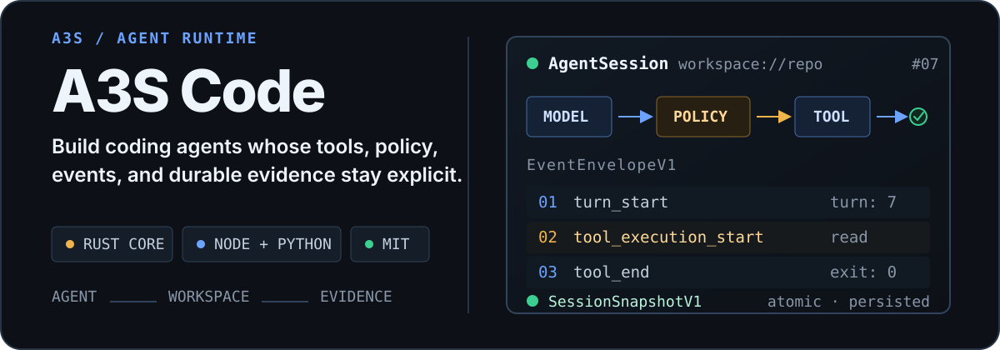

<p align="center">
  
</p>

<p align="center">
  <a href="https://github.com/A3S-Lab/Code/releases"></a>
  <a href="https://github.com/A3S-Lab/Code/actions/workflows/ci.yml"></a>
  <a href="https://crates.io/crates/a3s-code-core"></a>
  <a href="https://www.npmjs.com/package/@a3s-lab/code"></a>
  <a href="https://pypi.org/project/a3s-code/"></a>
  <a href="./LICENSE"></a>
</p>

**A3S Code** is an async Rust runtime for building governed coding agents. It
keeps the agent loop, workspace tools, model adapters, policy decisions,
versioned events, and durable evidence behind explicit contracts. Use it from
Rust, Node.js, Python, Go, or through the `a3s code` terminal application.

<p align="center">
  <a href="#start-in-60-seconds">Start</a> ·
  <a href="#why-a3s-code">Why Code</a> ·
  <a href="#capability-map">Capabilities</a> ·
  <a href="#configure-the-runtime">Configure</a> ·
  <a href="#architecture">Architecture</a> ·
  <a href="#documentation">Documentation</a>
</p>

## Start in 60 seconds

### Run the terminal product

```bash
brew install A3S-Lab/tap/a3s

# Or install from crates.io
cargo install a3s

cd /path/to/your/project
a3s code
```

The terminal product streams reasoning, tool activity, approvals, task
progress, and diffs. Resume persisted work with `a3s code resume` or
`a3s code resume <session-id>`.

### Embed the runtime

```bash
cargo add a3s-code-core
cargo add tokio --features macros,rt-multi-thread
```

```rust,no_run
use a3s_code_core::{Agent, AgentEvent};

#[tokio::main]
async fn main() -> a3s_code_core::Result<()> {
    let agent = Agent::new("agent.acl").await?;
    let session = agent.session_builder(".").build().await?;

    let (mut events, lifecycle) = session
        .stream("Find the authentication entry points.", None)
        .await?;

    while let Some(event) = events.recv().await {
        match event {
            AgentEvent::TextDelta { text } => print!("{text}"),
            AgentEvent::End { .. } => break,
            _ => {}
        }
    }

    let _ = lifecycle.await;
    Ok(())
}
```

`Agent` owns resolved configuration and shared capabilities. `AgentSession`
binds them to one workspace and conversation. The event stream is the product
boundary: a host can render the same lifecycle that the runtime persists and
replays.

## Why A3S Code

| Requirement | Runtime mechanism |
| --- | --- |
| **Govern every side effect** | JSON argument validation, typed tool capabilities, permission policy, human confirmation, hooks, budgets, security providers, and cancellation share one invocation path. |
| **Keep context bounded** | Reads, searches, command output, Git results, and fetched pages expose ranges or cursors. Large evidence moves into bounded artifacts with previews, sizes, and hashes. |
| **Own the UI without forking the loop** | Core emits `AgentEvent`; SDK streams and persisted runs use the lossless `EventEnvelopeV1` protocol. The host chooses presentation, identity, credentials, and deployment policy. |
| **Resume from evidence, not guesswork** | `SessionSnapshotV1` can atomically commit session state, runs, artifacts, traces, verification reports, and child-task records as one generation. |

One turn follows a visible chain of responsibility:

```text
user request
    │
    ▼
workspace-bound AgentSession
    │ context + memory
    ▼
model adapter
    │ proposed tool call
    ▼
validation → permission → confirmation → budget → sandbox
    │ governed result
    ▼
AgentEvent / EventEnvelopeV1
    │
    └── runs + traces + artifacts + SessionSnapshotV1
```

This separation lets an interactive terminal, an SDK application, and a
background service share the same execution semantics without sharing a UI.

## Capability map

The Core crate enables lazy Chrome/Chromium-backed search by default. Minimal
embeddings can use `default-features = false`; cloud backends, serving, and
telemetry remain opt-in.

| Area | What is available | Activation |
| --- | --- | --- |
| Agent runtime | Async `Agent`, workspace-bound `AgentSession`, send, stream, resume, replace, cancel, close, and replay | Baseline |
| Governed tools | Files, search, shell, Git, web, structured generation, batch, program, Skills, MCP, and delegation | Exposed only when workspace and policy allow |
| Code intelligence | Saved-file symbols, definitions, declarations, references, implementations, diagnostics, revisions, and stale-state metadata | Host-selected local workspace |
| Context and memory | Ranked context, repeated compaction, three-tier memory, typed stores, recall, extraction, relations, and pruning | Host-selected and configurable |
| Model adapters | Anthropic, Zhipu, OpenAI-compatible APIs, and custom `LlmClient` implementations | Configuration or host injection |
| Structured output | Native provider formats or schema-validated prompt, partial parse, and repair fallback | Baseline |
| MCP and Skills | Isolated MCP transports plus filesystem, registry, inline, and live session Skills | Configuration or live registration |
| Planning and delegation | Optional plans and goals, foreground/background workers, bounded parallel tasks, progress, and targeted cancellation | Manual tools independently configurable; automation opt-in |
| Programmable workflows | Bounded QuickJS `program` calls and replayable A3S Flow-backed dynamic workflows | `program` baseline; dynamic runtime explicitly registered |
| Persistence | Atomic snapshots, run events, traces, artifacts, verification, checkpoints, and optional RL trajectories | Configured store and host policy |
| State graph | Hash-linked events, typed objects and relations, optimistic patches, strict replay, forks, diffs, and Flow projection | Explicit application use |
| Agent release contract | Bounded `.a3s/asset.acl` admission, canonical identity, provenance binding, and compatibility checks | Baseline admission API |
| Headless web search | Lazy Chrome/Chromium-backed Google/Baidu engines and managed browser lifecycle APIs; Lightpanda remains configurable | Default Cargo feature `headless-search`; disable with `default-features = false` |
| S3 workspace | S3-compatible object backend | Cargo feature `s3` |
| Filesystem agent server | Agent-directory cron serving with post-preparation readiness, typed failure state, and bounded joined shutdown | Cargo feature `serve` |
| OpenTelemetry | OTLP export in addition to baseline `tracing` | Cargo feature `telemetry` |

Availability never bypasses policy. Auto-save, automatic compaction, goals,
automatic delegation, sandboxing, human approval, trajectory recording, and
graph integration run only when a host configures them. Memory extraction is
configurable and can be disabled.

## Configure the runtime

A3S Code uses [A3S ACL](https://github.com/A3S-Lab/ACL) for product
configuration. Keep credentials in environment variables rather than source.

```acl
default_model = "anthropic/claude-sonnet-4-20250514"

providers "anthropic" {
  api_key = env("ANTHROPIC_API_KEY")

  models "claude-sonnet-4-20250514" {
    name = "Claude Sonnet"
    tool_call = true
    limit = {
      context = 200000
      output = 8192
    }
  }
}

storage_backend = "file"
sessions_dir = ".a3s/sessions"
memory_dir = ".a3s/memory"
skill_dirs = [".a3s/skills"]
agent_dirs = [".a3s/agents"]
```

`Agent::new` accepts an ACL path or inline ACL. Build sessions asynchronously
so configuration, stores, queues, MCP sources, and workspace services are
resolved before the first turn.

```rust,no_run
use a3s_code_core::{Agent, PlanningMode, SessionOptions};

#[tokio::main]
async fn main() -> a3s_code_core::Result<()> {
    let options = SessionOptions::new()
        .with_planning_mode(PlanningMode::Auto)
        .with_tool_timeout(120_000)
        .with_auto_compact(true)
        .with_max_context_tokens(200_000)
        .with_auto_compact_threshold(0.8);

    let _session = Agent::new("agent.acl")
        .await?
        .session_builder("/path/to/workspace")
        .options(options)
        .build()
        .await?;

    Ok(())
}
```

Typed session options accept custom model clients, context providers, memory
stores, session stores, workspace backends, security providers, confirmation
providers, permission checkers, and other host-owned extensions.

## Tools that respect the workspace

A tool is registered only when its workspace exposes the capability it needs.
An object-only backend does not advertise local `bash` or `git` definitions to
the model.

| Concern | Built-in surface |
| --- | --- |
| Files and directories | Budgeted single/multi-file `read`, `write`, previewable CAS `edit`, `patch`, `ls`, order-selectable paginated `glob`, and mode-selectable `grep` |
| Commands and source control | Bounded `bash` plus typed `git` operations, cancellation, and Unix process-group termination |
| Code intelligence | `code_symbols`, `code_navigation`, and `code_diagnostics`; source reading and mutation remain in file tools |
| Web evidence | Fail-closed native API → HTTP/RSS → lazy Chrome/Chromium `web_search` with quality gates, shared admission, circuits, and request coalescing; plus bounded `web_fetch`, source normalization, and SSRF protections |
| Downloads | Workspace-confined binary `download` with strict range validation, bounded parallelism, retries, checksums, and atomic publication |
| Composition | Safe `batch`, sandboxed QuickJS `program`, structured `generate_object`, `task`, and `parallel_task` |
| Extensibility | `Skill`, `search_skills`, namespaced `mcp__<server>__<tool>`, and explicit `dynamic_workflow` |

Every invocation declares `ToolCapabilities`, including read-only,
idempotent, resumable, cancellation-safe, paginated, output-kind, and parallel
limits. `batch` parallelizes only calls that declare safe read-only behavior;
mutations and unknown tools are serialized.

### Context-efficient repository tools

`read` can pack 1-32 known text files into one ordered response. The shared
budget includes headers and the continuation itself, so the result reaches the
model intact instead of relying on downstream truncation:

```json
{
  "files": [
    { "path": "src/lib.rs" },
    { "path": "src/config.rs", "offset": 40, "limit": 80 }
  ],
  "max_output_bytes": 65536
}
```

If the budget fills, copy `metadata.batch.continuation` back into `files`.
Offsets and remaining per-file limits are advanced without repeating completed
lines. One missing or unreadable member is reported in its own segment while
the other files continue.

`grep.output_mode` controls how much evidence enters the context:

| Mode | Result |
| --- | --- |
| `content` | Matching lines with optional context (default) |
| `files_with_matches` | Lexically cursor-paginated matching paths only |
| `count` | Lexically cursor-paginated matching-line counts per file |
| `summary` | Full-scan line and file totals without rendered matches |

The non-content modes ask built-in workspace backends to count matches without
constructing discarded match text. `glob` retains a backend's recency or
relevance order by default; request `sort: "path"` when cursor pages require
stable lexical ordering.

Use `edit` with `dry_run: true` to receive the exact before/after diff without
writing. The dry run is declared read-only and can be safely batched. Apply the
result with `expected_replacements` and optionally `max_replacements` to reject
stale or unexpectedly broad changes before the compare-and-swap write.

Web evidence keeps retry decisions typed. `web_search` records tier quality,
engine outcomes, durations, circuit state, and retry context; `web_fetch`
classifies transport failures and HTTP 429 separately and preserves a
parseable `Retry-After` delay. Neither path infers retryability from rendered
error prose.

### Sandbox and credential boundaries

Hosts can attach a `BashSandbox`. The fail-closed local `SrtBashSandbox` limits
writes to the active workspace and private run scratch space, protects agent
control metadata, blocks common credential reads, scrubs ambient secrets, and
denies command network access, local binding, and Unix sockets. It never falls
back to an unsandboxed host runner if its configured runtime fails.

Shell isolation does not automatically govern in-process file tools. Local
hosts should explicitly select `LocalWorkspaceAccessPolicy::CredentialBoundary`
when direct workspace operations need the same credential boundary. See the
[Advanced Developer Manual](manual/ADVANCED_DEVELOPER_MANUAL.md) for the full
contract and host responsibilities.

## Context, memory, and models

`ContextAssembler` ranks and budgets filesystem, recent-file, ripgrep, memory,
prompt-slot, project-instruction, Skill, and custom provider inputs. Automatic
compaction is opt-in and can re-arm across long sessions. It retains the latest
request and unresolved tool calls while treating generated summaries as
untrusted transcript data.

Memory separates working, short-term, and durable state. When memory is active,
semantic extraction is enabled by default and can be disabled. It records only
validated reusable memories with source, confidence, scope, reason, workspace,
session, and schema metadata rather than mechanically persisting every tool
result or conversation turn.

Model adapters normalize text, reasoning, images, tool calls, token usage,
streaming, cancellation, and retries. Structured generation uses native
provider response formats when available and schema validation plus repair
otherwise. Provider-facing schemas remain available as host-only validation
metadata for composite streaming clients, and clients explicitly declare
whether a blocking structured call uses a transport independent from their
streaming path. MCP supports stdio, SSE, streamable HTTP, OAuth client
credentials, refresh, and live session-scoped add/remove operations.

## Orchestration without hidden authority

- Planning can be automatic, forced, or disabled; goal tracking is opt-in.
- `AgentDefinition` and `WorkerAgentSpec` describe reusable and disposable
  workers without weakening parent policy.
- Foreground and background tasks expose progress, sources, structured output,
  cancellation, and durable task records.
- Sequential, parallel, resumable, loop, budget, and checkpoint primitives are
  available for deterministic host workflows.
- `program` runs bounded JavaScript in QuickJS with explicit tool, time,
  recursion, call-count, and output limits.
- `dynamic_workflow` is absent from a plain session until the host registers an
  A3S Flow-backed runtime.

Dynamic workflows can bound independently session-forked structured generation
with `maxConcurrentGenerations` (1-4); providers without session forking remain
single-flight. Durable completed-step recovery is bound to the exact run id,
original query, and step id rather than acting as a cross-run query cache.

Delegated tasks, workflows, and Skill child runs retain the parent sandbox and
intersect local permission policy with the parent checker. A child auto-approve
setting cannot waive a host escalation boundary.

## Events, persistence, and replay

`AgentEvent` covers text, reasoning, tools, confirmation, planning, tasks,
memory, compaction, budgets, verification, and terminal state. SDKs and run
replay project these values through `EventEnvelopeV1`, which preserves its
version, event type, complete payload, and optional metadata. Older SDK clients
can retain future event names and payloads they do not yet understand.

A configured `SessionStore` can persist complete `SessionSnapshotV1`
generations. Runs expose status, active tools, ordered event replay, exclusive
pagination cursors, and retention-gap detection. File persistence uses atomic
replacement; artifacts are bounded by item count and bytes; verification keeps
claims separate from evidence.

The optional state graph is a complementary coordination runtime, not hidden
session state:

```text
external or agent event
        │
        ▼
hash-linked GraphEventRecord log
        │ strict projection
        ▼
typed objects + typed relations
        │ matching behaviors
        ▼
optimistic GraphPatch → new version or explicit rejection
```

Applications opt into graph replay, branches, diffs, and Flow projection when
multiple agents or behaviors need one auditable shared model.

## Runtime surfaces

| Surface | Package | Intended use |
| --- | --- | --- |
| Terminal | [`a3s code`](https://github.com/A3S-Lab/CLI) | Interactive coding product built on Core and the shared [A3S TUI](https://github.com/A3S-Lab/TUI) |
| Rust | [`a3s-code-core`](https://crates.io/crates/a3s-code-core) | Complete runtime API and extension traits |
| Node.js | [`@a3s-lab/code`](https://www.npmjs.com/package/@a3s-lab/code) | Native N-API bindings for async lifecycle, streams, tools, stores, orchestration, MCP, and state graph |
| Python | [`a3s-code`](https://pypi.org/project/a3s-code/) | Native PyO3/bootstrap package with sync and async application APIs |
| Go | [`github.com/A3S-Lab/Code/sdk/go/v6`](sdk/go/README.md) | Pure-Go client with a versioned local bridge for sessions, streams, tools, runs, verification, and MCP |

```bash
# Node.js
npm install @a3s-lab/code

# Python
python -m pip install a3s-code

# Go
go get github.com/A3S-Lab/Code/sdk/go/v6
```

The native SDK crates explicitly enable the Core `headless-search`, `s3`, and
`serve` features to preserve their complete product surface. Direct Rust
embedders receive the lazy Chrome/Chromium search tier by default and can omit
the browser dependency stack with `default-features = false`. The pure-Go
package uses the matching `a3s-code-go-bridge` release asset and requires no
CGO. See the
[Node.js](sdk/node/README.md), [Python](sdk/python/README.md), and
[Go](sdk/go/README.md) guides for surface-specific examples and intentional API
differences.

## Architecture

```text
Rust host / Node SDK / Python SDK / Go SDK / a3s code
                         │
                       Agent
                         │
                    AgentSession
        ┌────────────────┼────────────────┐
        │                │                │
 context + memory   model adapters   governed tools
        │                │                │
        └────────────────┼────────────────┘
                         │
       events + runs + traces + artifacts + snapshots
                         │
              optional StateGraph / Flow bridge
```

Core owns lifecycle, ordering, and execution contracts. Public extension
boundaries include `LlmClient`, `ContextProvider`, `MemoryStore`,
`SessionStore`, workspace service traits, tools, permissions, confirmations,
hooks, security, MCP transports, and graph stores.

Source is grouped by concern under `agent_api/`, `tools/`, `workspace/`,
`context/`, `llm/`, `mcp/`, `orchestration/`, `store/`, and `state_graph/`.
Node.js and Python bindings remain separate native crates over the same Core.
The Go SDK reaches that Core through a long-lived, capability-checked local
bridge process.

## Filesystem-first agents and releases

`AgentDir` keeps reusable agents reviewable as files:

```text
agent-dir/
├── instructions.md
├── agent.acl
├── skills/
├── tools/
└── schedules/
```

Tool specifications can connect MCP servers or bounded PTC scripts. With the
`serve` feature, a host can serve an agent directory and run cron schedules.
The observable daemon handle becomes ready only after schedules, sessions, and
tools are prepared; shutdown cancels in-flight work, closes owned sessions, and
joins within a bounded deadline. Files never bypass workspace, permission,
confirmation, or verification policy.

`AgentReleaseManifest` admits the versioned `.a3s/asset.acl` contract, derives
schema-aware canonical ACL and a SHA-256 identity, and verifies runtime
compatibility before activation. Secret declarations are typed injection slots;
values remain outside the release document.

Release admission validates metadata. It does **not** build or run an OCI
artifact, implement health behavior, or own deployment lifecycle. Read the
[Agent Release Contract](manual/AGENT_RELEASE_CONTRACT.md) before integrating
the v1 schema.

## Explicit boundaries

- Core is an embeddable runtime, not a hosted agent service or a terminal
  widget library.
- The separate A3S CLI owns the interactive TUI, account adapters, presentation
  policy, and optional A3S OS integration.
- Hosts own user identity, credential access, deployment policy, and trust
  decisions around direct host tool calls.
- Sandboxing, persistence, automatic compaction, goals, delegation, and graph
  projection require explicit host configuration; memory extraction remains
  host-configurable.
- A session permits one transcript-affecting operation at a time; concurrent
  send, stream, attachment, command, or resume operations fail fast.

## Documentation

| Guide | Focus |
| --- | --- |
| [User Guide](manual/USER_GUIDE.md) · [Chinese](manual/USER_GUIDE_CN.md) | Installation, configuration, sessions, tools, and common workflows |
| [Advanced Developer Manual](manual/ADVANCED_DEVELOPER_MANUAL.md) · [Chinese](manual/ADVANCED_DEVELOPER_MANUAL_CN.md) | Extension contracts, security, lifecycle, and production integration |
| [SDK API Design](manual/SDK_API_DESIGN.md) | Cross-language API conventions and alignment |
| [Go SDK](sdk/go/README.md) | Bridge installation, sessions, event streaming, direct tools, errors, and release compatibility |
| [Code Intelligence Design](manual/CODE_INTELLIGENCE_DESIGN.md) | Language runtime, capability boundary, lifecycle, and verification |
| [Agent Directory Tools](manual/AGENT_DIR_TOOLS_DESIGN.md) | Filesystem-first tool and agent definitions |
| [Agent Release Contract](manual/AGENT_RELEASE_CONTRACT.md) | Admission schema, identity, compatibility, and security boundary |
| [Changelog](CHANGELOG.md) | Release history and migration-relevant changes |

## Development

Run checks from the A3S Code repository directory:

```bash
cargo fmt --all -- --check
cargo test -p a3s-code-core
cargo test -p a3s-code-core --all-features
cargo clippy -p a3s-code-core --all-targets --all-features -- -D warnings
node scripts/sdk_api_alignment_check.mjs
cargo test -p a3s-code-go-bridge
go -C sdk/go test ./...
```

Real-provider, browser-runtime, and S3 tests are ignored unless their external
prerequisites are configured. The normal test suite is hermetic.

Run the context-tool real-LLM suite through a local Codex login:

```bash
A3S_CONTEXT_TOOLS_USE_CODEX_LOGIN=1 scripts/context_tools_real_llm.sh
```

Alternatively, point `A3S_CONFIG_FILE` at an ACL provider configuration and
run the same script without `A3S_CONTEXT_TOOLS_USE_CODEX_LOGIN`.

## License

[MIT](LICENSE)
